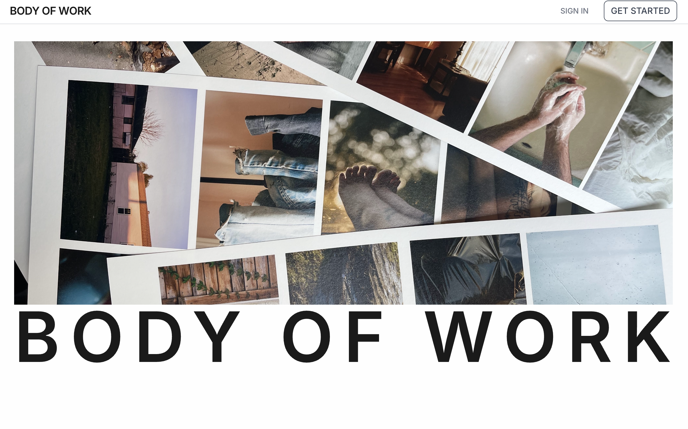
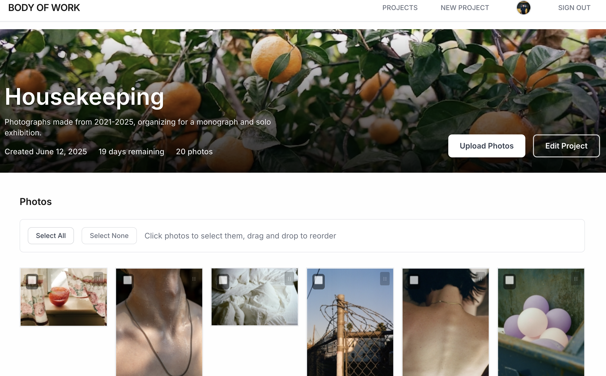
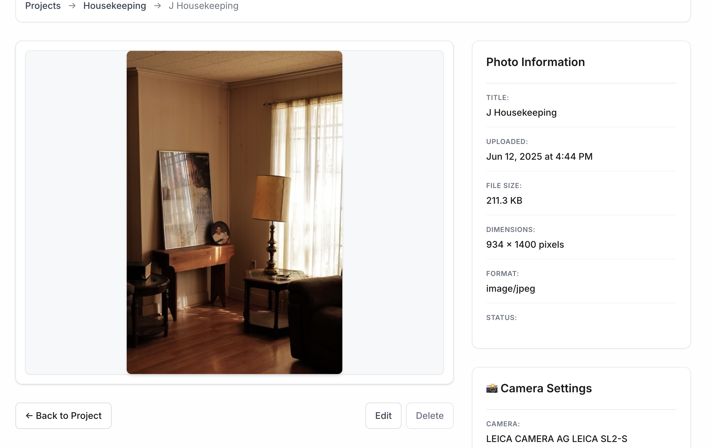

# Body of Work

#### A comprehensive photography project management system designed to help photographers organize shoots, collaborate with teams, and manage their creative workflows from planning to delivery.



## Description

Body of Work is a platform that empowers photographers to organize their creative projects efficiently. Create projects, upload photos with automatic metadata extraction, organize your work with drag-and-drop functionality, and collaborate with team members. Whether you're managing a single photoshoot or coordinating multiple ongoing projects, Body of Work provides the tools you need to stay organized and focused on your craft.

## Table of Contents

- [Design](#design)
- [Technologies Used](#technologies-used)
- [Features](#features)
- [Installation](#installation)
- [Project Status](#project-status)
- [Next Steps](#next-steps)
- [Contributing](#contributing)

## Design

### Design Philosophy

Body of Work follows a **content-first design approach**, where the photography takes center stage while the interface remains clean and unobtrusive. The design emphasizes functionality and workflow efficiency over decorative elements.




### Visual Design Choices

#### **Minimal Color Palette**
- **Neutral Foundation**: White backgrounds and subtle grays ensure photos remain the focal point
- **Accent Colors**: Minimal use of color only for important actions and status indicators
- **High Contrast**: Black text on white backgrounds for maximum readability

#### **Typography**
- **Primary Font**: Inter - A modern, highly legible typeface designed for digital interfaces
- **Font Hierarchy**: Clear distinction between headings, body text, and UI elements
- **Responsive Sizing**: Scales appropriately across device sizes

#### **Layout Strategy**
- **CSS Grid**: Responsive photo grids that adapt to screen size and content
- **Natural Aspect Ratios**: Photos display in their original proportions, avoiding forced cropping
- **Generous Whitespace**: Breathing room around content reduces visual clutter

### User Experience Design

#### **Progressive Disclosure**
- **Hover Interactions**: Photo actions and details appear on hover to reduce interface noise
- **Overlay Information**: Photo metadata and controls slide over images rather than taking permanent space
- **Expandable Sections**: Technical details like EXIF data are hidden by default but easily accessible

#### **Workflow-Centered Navigation**
- **Breadcrumb Trails**: Clear navigation showing project → photo relationships
- **Contextual Actions**: Edit, delete, and organize tools appear where users expect them
- **Bulk Operations**: Efficient selection and management tools for handling multiple photos

#### **Mobile-First Responsive Design**
- **Touch-Optimized**: Larger tap targets and gesture-friendly interactions
- **Adaptive Layouts**: Photo grids reorganize for optimal viewing on different screen sizes
- **Progressive Enhancement**: Core functionality works without JavaScript, enhanced features add convenience

### Interface Patterns

#### **Photo Grid System**
- **Masonry-Style Layout**: Photos display at natural sizes while maintaining grid alignment
- **Lazy Loading**: Images load as needed to improve performance
- **Selection States**: Clear visual feedback for selected photos during bulk operations

#### **Form Design**
- **Inline Validation**: Real-time feedback during form completion
- **File Upload Enhancement**: Drag-and-drop areas with preview functionality
- **Progress Indicators**: Visual feedback during file uploads and processing

#### **Confirmation Patterns**
- **Destructive Action Protection**: Clear warnings before deleting projects or photos
- **Undo Prevention**: Confirmation dialogs prevent accidental data loss
- **Success Feedback**: Clear messaging when actions complete successfully

### Design Inspiration

The interface draws inspiration from professional photography workflows and modern content management systems:

- **Adobe Lightroom**: Grid view and photo organization patterns
- **Professional Portfolios**: Clean, gallery-focused layouts
- **Modern Web Apps**: Progressive enhancement and responsive design patterns


### Accessibility Considerations

- **Screen Reader Support**: Semantic HTML and proper ARIA labels
- **Color Independence**: Information conveyed through more than just color
- **Focus Management**: Clear focus indicators for keyboard users


## Technologies Used

### Backend Framework
- **Django 5.2** 
- **PostgreSQL** 
- **Python 3.13** 

### File Storage & Processing
- **Cloudinary** – Cloud-based image and video management
- **Pillow** – Python Imaging Library for image processing
- **ExifRead** – Extract EXIF metadata from images

### Frontend Enhancement
- **Django Templates** – Server-side rendering with template inheritance
- **SortableJS** – Drag-and-drop functionality for photo reordering
- **Vanilla JavaScript** – Progressive enhancement for interactive features

### Authentication & Security
- **Django Auth** – Built-in user authentication system
- **Django CSRF** – Cross-site request forgery protection
- **Django Rate Limiting** – Request rate limiting for security
- **bcrypt** – Password hashing (via Django)

### Development Tools
- **python-decouple** – Environment variable management
- **django-widget-tweaks** – Enhanced form rendering
- **psycopg2-binary** – PostgreSQL adapter for Python

### Styling & UI
- **CSS3** 
- **Google Fonts (Inter)** 
- **Custom CSS Grid** – Responsive photo gallery layouts

---

### Stack

This project uses a **modern Django stack**:

- **Django** (Backend Framework)
- **PostgreSQL** (Database)
- **Cloudinary** (File Storage)
- **Vanilla JS** (Frontend Enhancement)

## Features

### User Management
- **User Authentication**
  - Sign up as a new photographer
  - Log in with existing account
  - Custom user profiles with avatars and bios
  - Account management and deletion

### Project Management
- **Full Project CRUD**
  - Create photography projects with cover photos
  - Edit project details and descriptions
  - Set target completion dates
  - Delete projects with confirmation

### Advanced Photo Management
- **Smart Photo Upload**
  - Single and bulk photo uploads (up to 20 photos)
  - Automatic EXIF metadata extraction
  - File validation (size, type, integrity)
  - Support for JPEG, PNG, TIFF, WEBP, HEIC formats

- **Photo Organization**
  - Drag-and-drop photo reordering
  - Bulk selection and operations
  - Photo status system (featured, needs attention)
  - Natural aspect ratio preservation in grids

- **Photo Details & Metadata**
  - Automatic camera settings extraction
  - File size and dimension tracking
  - Photo captions and titles
  - Technical EXIF data viewing

### User Experience Features
- **Responsive Design**
  - Mobile-friendly interface
  - Touch-optimized drag & drop
  - Progressive image loading

- **Interactive Elements**
  - File upload previews
  - Loading states and progress indicators
  - Confirmation dialogs for destructive actions
  - Real-time photo reordering

### Security & Performance
- **Security Measures**
  - CSRF protection on all forms
  - Rate limiting on upload endpoints
  - Secure file validation
  - Permission-based access control

- **Performance Optimizations**
  - Database indexing for fast queries
  - Cloudinary image transformations
  - Efficient bulk operations
  - Automatic file cleanup

## Installation

### Prerequisites
- Python 3.13+
- PostgreSQL 12+
- pip (Python package manager)
- Git


## Project Status

### Completed Features (75% Complete)
- User authentication and profile management
- Project CRUD operations
- Advanced photo upload and management
- Drag & drop photo reordering
- EXIF metadata extraction
- Bulk photo operations
- Responsive design
- Security and performance optimizations

### In Progress
- Folder organization system (database models exist)
- Project collaboration features (partially implemented)

### Planned Features
- Journal/notes system for project documentation
- Advanced search and filtering
- Enhanced collaboration tools

## Next Steps

### Phase 1: Core Organization 
- **Folder System Implementation**
  - Create, edit, delete folders within projects
  - Organize photos into folder collections
  - Folder-based navigation and management

### Phase 2: Enhanced Collaboration 
- **Team Collaboration**
  - Invite collaborators to projects
  - Permission-based access control
  - Multi-user project management

### Phase 3: Documentation & Notes 
- **Journal System**
  - Project-level and folder-level notes
  - Creative process documentation
  - Team communication tools

### Phase 4: Advanced Features 
- **Search & Filtering**
  - Search photos by metadata
  - Advanced filtering options
  - Tag-based organization

## Technical Architecture

### Database Design
```
Users (Custom AbstractUser)
├── Projects (owned by User)
│   ├── Photos (belong to Projects, future: organized in Folders)
│   └── ProjectMembers (collaboration through table)
```

### File Storage Strategy
- **Cloudinary Integration**: Automatic image optimization, transformations, CDN delivery
- **Django Signals**: Automatic cleanup of orphaned files
- **Multiple Format Support**: JPEG, PNG, TIFF, WEBP, HEIC

### Security Implementation
- Django's built-in CSRF protection
- Rate limiting on file uploads
- Comprehensive file validation
- Secure cloud storage with Cloudinary

## Contributing

This is currently a solo project.


## Acknowledgments

- Django community for excellent documentation
- Cloudinary for robust image management
- SortableJS for smooth drag & drop functionality
- Google Fonts for the Inter typeface

## Attributions

- https://cloudinary.com/documentation/django_integration
- https://pypi.org/project/python-decouple/
- https://www.geeksforgeeks.org/python/python-datetime-timedelta-function/
- https://docs.djangoproject.com/en/5.2/topics/pagination/
- https://docs.djangoproject.com/en/5.2/topics/signals/
- https://pypi.org/project/pillow/
- https://www.geeksforgeeks.org/python/transaction-atomic-with-django/
- https://sortablejs.github.io/Sortable/
- https://www.w3schools.com/howto/howto_css_breadcrumbs.asp
- https://www.geeksforgeeks.org/python/how-to-customize-django-forms-using-django-widget-tweaks/


## Contact

Casey Joiner - caseyejoiner@gmail.com

Project Link: [Body of Work](https://body-of-work-453020c24178.herokuapp.com/)
